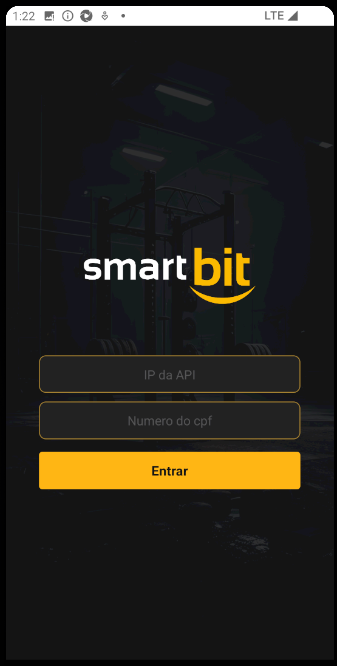
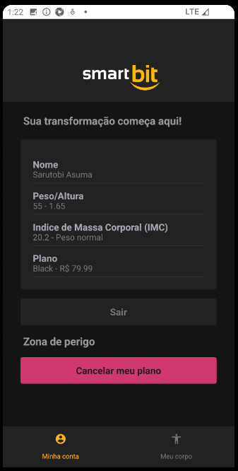
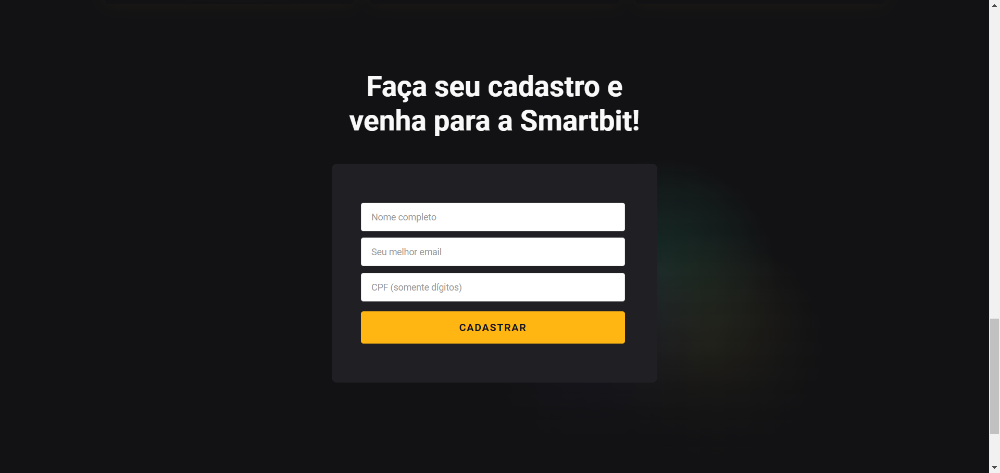
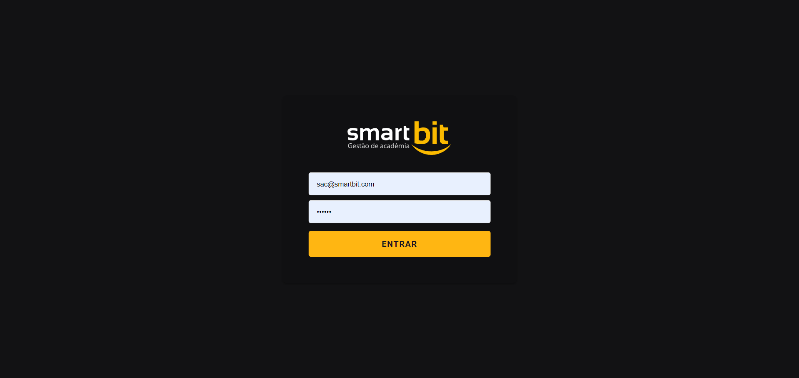
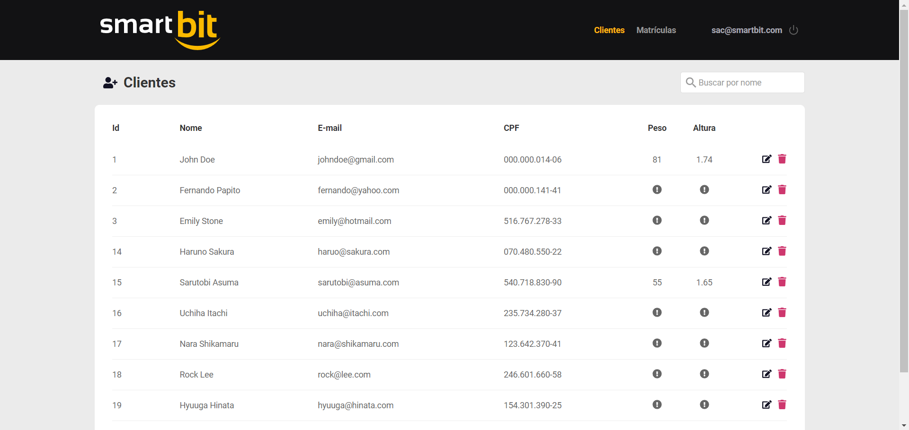
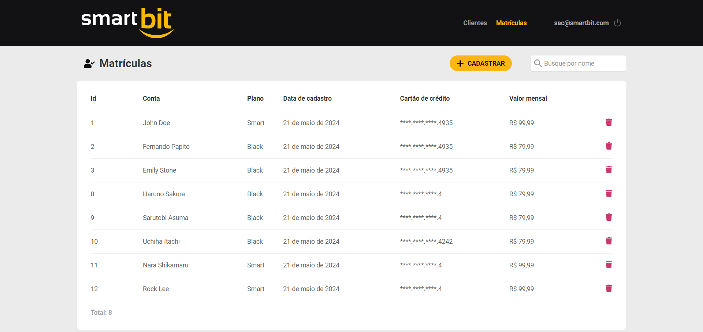
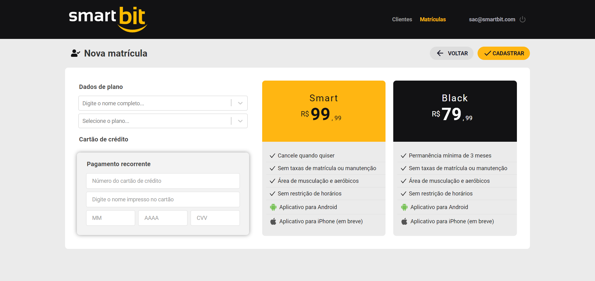

# universo-robot
 
Automated tests for web and mobile (Android) application using Robot Framework and Appium.

## 📚 Course
[Universo Robot Framework - Udemy](https://www.udemy.com/course/universo-robot-framework/)

## ✅ What I learned
- Automated Web testing using Browser Library
- Automated API testing using Requests Library
- Automated Mobile testing using Appium
- Manual API testing using Insomnia
- Test Setup and Test Teardown
- Page objects pattern
- Component testing
- Custom Python libs
- Manipulating JSON objects
- SQL scripts
- PostgreSQL database and pgAdmin 4 with Docker
- Cross-browser testing
- Enviroment variables with python-dotenv

## 🌐 Application
Smartbit is a fictitious gym application where the client starts their registration on the web application and visit the nearest branch to finish the membership process. On the native mobile app (Android) they can manage their account, register their body measurements, check their BMI (IMC) and cancel their gym membership.

The gym administrator uses the web application to complete the client registration, manage the clients and their memberships.

*Mobile application*
   

*Web application*
   
  

## 🧪 Test cases
todo

## 💻 Technologies and Tools used
- **Python**: Programming language used to create custom libraries
- **Robot Framework**: Test automation framework
- **Robot Framework dependencies**: `python -m pip install -r requirements.txt`
- **Appium**: Automation mobile testing tool
- **Android Studio**: Run the Android Virtual Device (AVD) emulator 
- **Appium Inspector**: GUI for inspecting and interacting with the mobile app elements  
- **Insomnia**: Manual API testing